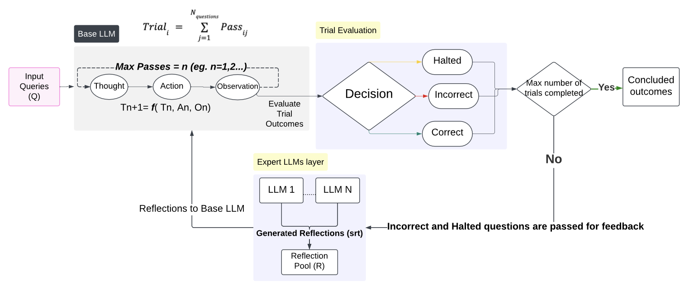
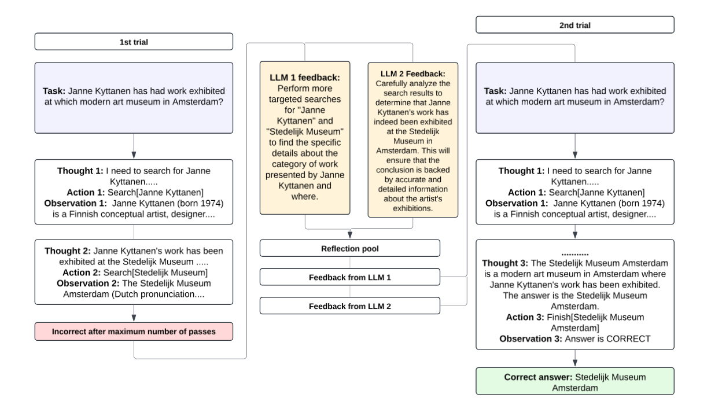

# Enhancing LLM Reasoning Capabilities Through Brokered Multi-Expert Reflection
This repo holds the code and log files for Enhancing LLM Reasoning Capabilities Through Brokered Multi-Expert Reflection by Tejasvee Sheokand, Garveet Jain, Arshdeep Bahga, Vijay K. Madisetti.

## Abstract
Large Language Models (LLMs) have found increasing application in tasks requiring multistep reasoning, yet challenges such as hallucinations and inconsistencies in the generated responses persist. This study presents an innovative methodology to enhance the reasoning capabilities of LLMs by brokering and integrating multiple expert LLMs within a reflection layer to provide targeted feedback on the reasoning
trajectories of the base LLM. The approach employs a foundational pre-trained LLM as the base model, which is further supported by agents to promote cognitive assistance for specific task types. In instances
where conclusions are deemed incorrect or reasoning is interrupted, these instances are forwarded to the expert LLM layer, which includes systems such as Claude-3 haiku for intricate contexts and MedAlpaca for
medical reasoning, to deliver feedback on the base model’s reasoning paths. This feedback forms a ’reflection pool,’ enabling the base LLM to amend and enhance its reasoning trajectories in subsequent iterations.
The experiments conducted across diverse datasets, including HotPotQA, SimpleQA, and PubmedQA, underscore the proposed architecture’s efficacy in augmenting success signals, Rouge-L scores (indicative
of quality and precision), and CTRLEval Consistency Scores (indicative of coherence and consistency). The architecture effectively addresses the issues of hallucinations and inconsistencies that frequently occur in
multi-step reasoning. Importantly, the approach exhibits considerable potential in tackling domain-specific tasks, underscoring the importance of achieving correct and reliable conclusions.




## To Run
1. Install the module dependencies into your environment
```bash
pip install -r requirements.txt
```
2. Set environment variables to your API keys:

```bash
export OPENAI_API_KEY=<your key>
```
```bash
export ANTHROPIC_API_KEY=<your key>
```
```bash
export MISTRAL_API_KEY=<your key>
```
3. We have provided a set of notebooks to easily run, explore, and interact with the results of the reasoning experiments.

#### Note
Due to the significant API charges, it may not be feasible for individual developers to rerun all the results. All runs from the paper, along with additional runs, are logged in `./logs`.
